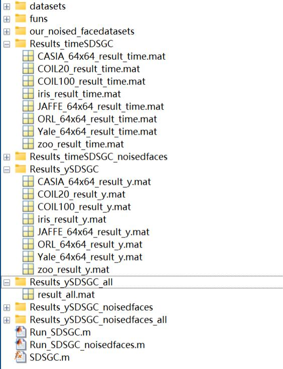

## Structured Doubly Stochastic Graph based Clustering
This is a Matlab implementation of our paper "Structured Doubly Stochastic Graph based Clustering". Code will be updated after paper is published. 
## Usage
# Main body 
  

# To Reproduce  the results in the paper, please dicretly run the following two ".m" files respectively.
* Run_SDSGC.m: run  SDSGC on real benchmarks.
* Run_SDSGC_noisedfaces.m: run SDSGC on our noised face data sets.
  
# For your own experiments, here are some important settings (Take "Run_SDSGC.m" as example)
First, set runtimes and test datasets in "Run_SDSGC.m" 
```
runtimes = 1; % runnings on each dataset, default: 1
dataname = {'iris','COIL20','zoo','COIL100','Yale_64x64','JAFFE_64x64','ORL_64x64','CASIA_64x64'}; 
```
Then, run  "Run_SDSGC.m".  The results of aLL datasets (benchamarks) are obtained simultaneously and recorded as the following forms.
# For result record

*  Seven clustering metrics are recorded (we only report three of them in the paper). For each dataset (benchamark), the accuracy (ACC), Normalized Mutual Information (NMI), Purity (PUR), Fscore, Precision (PRE), Recall (REC), Adjusted Rand Index (ARI), as well as  the average value (ave.) and standard deviation (std.) of them in total 5 runnings  (we set 5 runnings in the paper to demonstrate deterministic result) are recorded in "./Results_ySDSGC". For convenience,  the ave. and std. of seven metrics on all the datasets (benchmarks) are recorded in "./Results_ySDSGC_all". Moreover, the time cost of each running as well as the average value (ave.) and standard deviation (std.) in all 5 runnings are recorded in "./Results_timeSDSGC".
*  The following images show the form of data recording.
* 1) The results of seven metrics in all 5 runnings  (each dataset or benchamark): e.g., "./Results_ySDSGC/iris_result_y.mat".
  
  
* 2) The ave. and std. of  seven metrics in all 5 runnings (all  dataset or benchamark together): i.e., "./Results_ySDSGC_all/result_all.mat".
    
* 3) The time cost of each running as well as its average value (ave.) and standard deviation (std.) in all 5 runnings each dataset or benchamark): e.g., "./Results_timeSDSGC/iris_result_time.mat"
    

