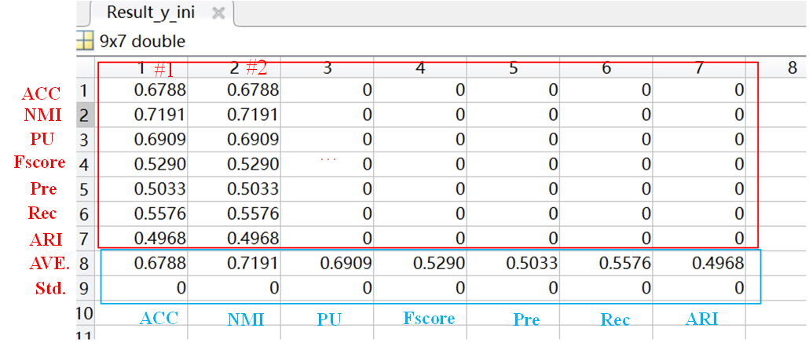
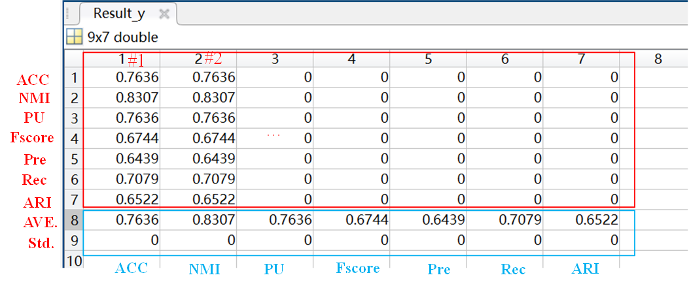
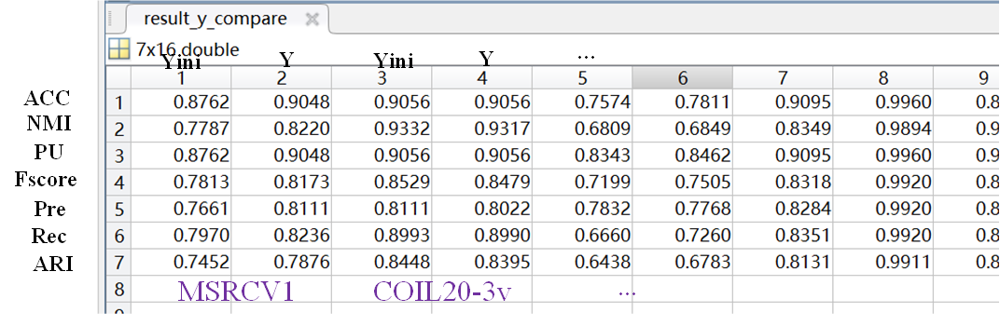
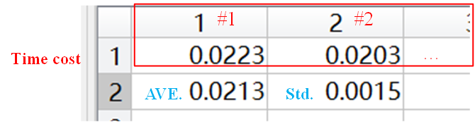

## Structured Doubly Stochastic Graph based Clustering
This is a Matlab implementation of our paper "Structured Doubly Stochastic Graph based Clustering". Code will be updated after paper is published. 
## Usage
# Main body 
The main body of code see figure
  

# To Reproduce  the results paper, please dicretly run the following two ".m" files respectively.
* Run_SDSGC.m: run  SDSGC on benchmarks.
* Run_SDSGC_noisedfaces.m: run SDSGC on our noised face data sets.
  
# For your own experiments, here are some important settings (Take "Run_SDSGC.m" as example)
First, set runtimes and test datasets in "Run_SDSGC.m" 
```
runtimes = 1; % runnings on each dataset, default: 1
dataname = {'iris','COIL20','zoo','COIL100','Yale_64x64','JAFFE_64x64','ORL_64x64','CASIA_64x64'}; 
```
Then, run  "Run_SDSGC.m".  The results of aLL datasets (benchamarks) are obtained simultaneously and recorded as the following forms.
# For result record

*  Seven clustering metrics are recorded (we only report three of them in the paper). For each running (we set 5 runnings in the paper), the accuracy (ACC), Normalized Mutual Information(NMI), Purity(Pu), Fscore, Precision (Pre), Recall(Rec), Adjusted Rand Index (ARI) of each dataset (benchamark) are recorded in . Simultaneously, the average value (ave.) and standard deviation (std.) of these seven metrics in total 5 runnings  are recorded in . Moreover, the time cost of each running as well as its average value (ave.) and standard deviation (std.) in total 5 runnings are recorded in .
*  The following images show the form of data recording.
  
  
* For better comparing y_ini and y, we also record the results of all dataset together.  The data record is shown in the figure.
    
* For time cost, we record the results of each dataset separately. The  data record is shown in the figure.
    

